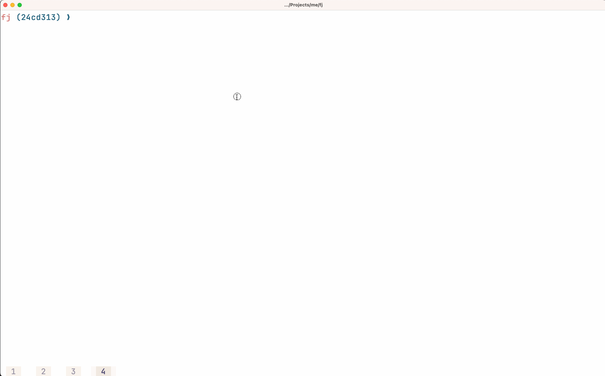

# fj

GitHub Stacked PR with JJ

## Install

```
go install github.com/lazywei/fj@latest
```

## Usage

- `fj` will create branch for each stacked commits, submit, and create PR
- `fj up` will run `jj git fetch` and `jj rebase -d main` and drop empty commits due to rebase


