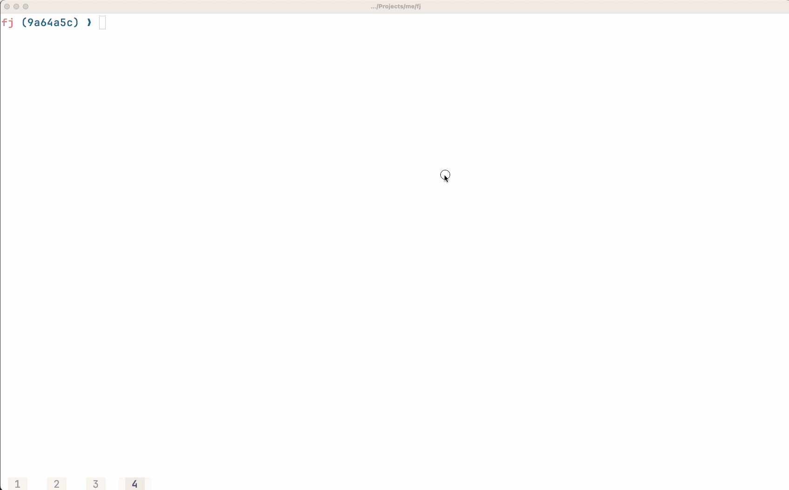
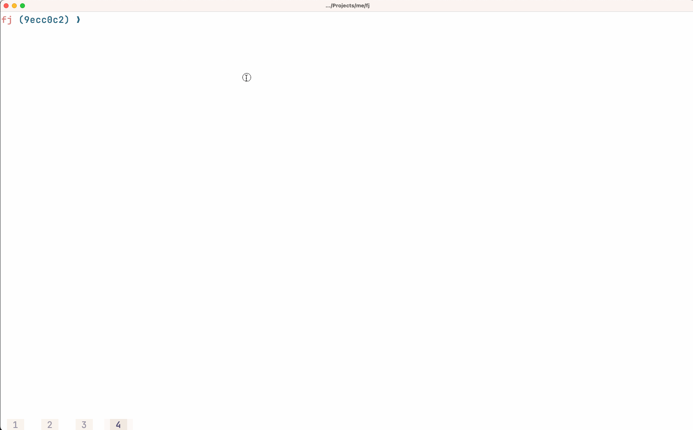

# fj

GitHub Stacked PR with JJ

## Install

```
go install github.com/lazywei/fj@latest
```

## Usage

### Create branches / PRs

The `fj` command will create a branch for each stacked commit, submit them, and create a Pull Request (PR). The body of the PR will be based on the commit message.


The `fj` command will also push any new updates if you modify the commits; updated commit messages will also be reflected in PR description.



### Update and Rebase after PR being merged

`fj up` will run `jj git fetch` and `jj rebase -d main` and drop empty commits due to rebase


